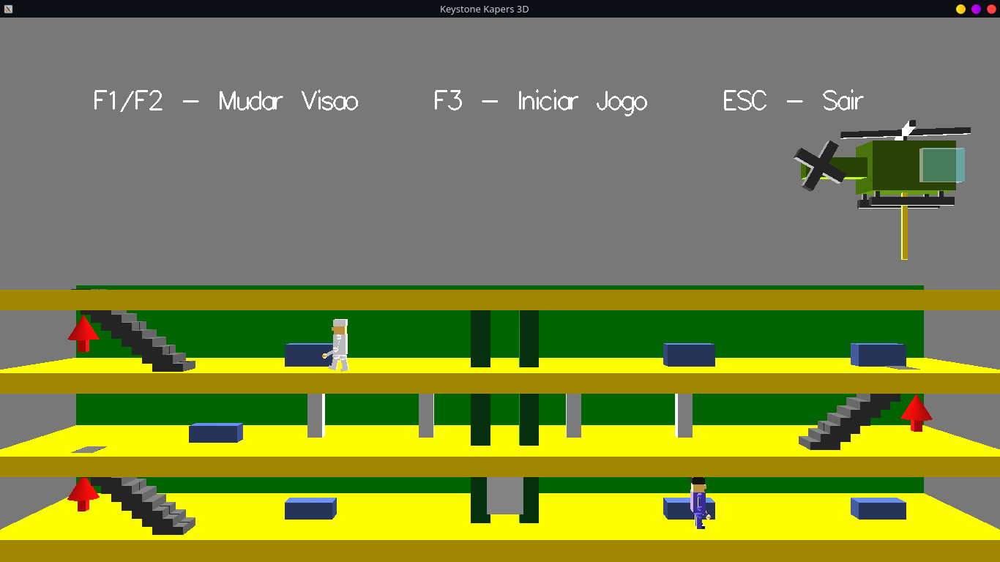

# Keystone Kapers no OpenGL

<h1 align="center">
  
</h1>

- Trabalho avaliativo para a disciplina de Computação Gráfica.
- Curso de Ciências da Computação na Universidade Federal de Jataí.
- <b>Ano de aplicação:</b> 2019.

## Descrição
Desenvolvimento da interface gráfica inspirado no jogo Keystone Kapers (1983) de Atari. As tarefas atribuídas foram as seguintes:
- Construir os elementos gráficos do cenário e personagens;
- Alternar o ponto de visão do jogador;
- Adaptar a jogabilidade conforme os elementos gráficos construídos;

## Como compilar (Linux)
- <b>Observação:</b> Primeiro, verifique se em sua máquina foi instalado os seguintes pacotes:

		apt-get libglu1-mesa-dev freeglut3-dev mesa-common-dev

-  Ao abrir o terminal na pasta do projeto, digite o seguinte comando para compilar:

		g++ kkGame.cpp -o Game.exe -lglut -lGL -lGLU -lm
    
- Depois, digite o comando a seguir para executar a aplicação: 

		./Game.exe 

